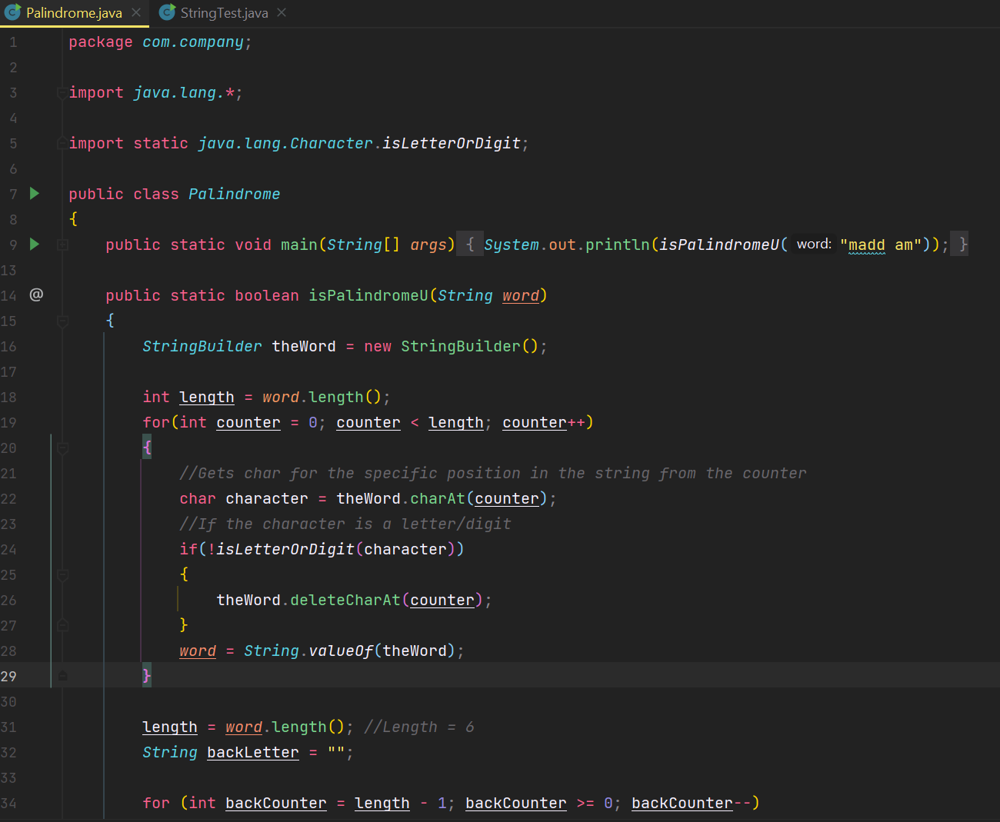
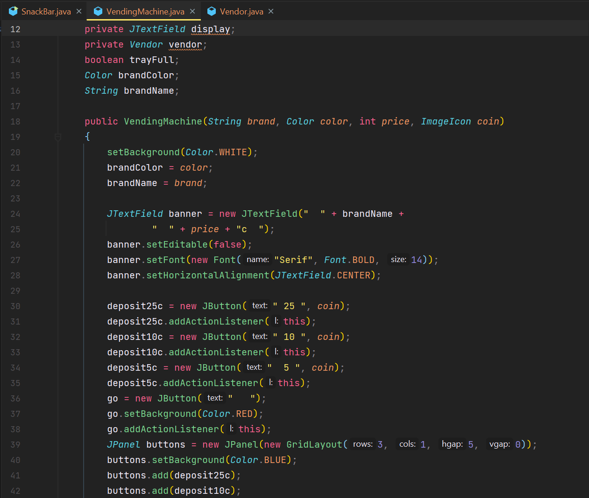

*Read this in its entirety before using this repository.*


### Forward
All programs assigned from the *Java Methods Object-Oriented Programming and Data Structures* textbook.
  
The `.java` files are provided for all programs assigned in Mr. Tenzca's AP Computer Science A class from 2021-2022. 

> Benevolently provided *for the benefit of humankind and confused students* 😝.

### Contents
All programs are contained in packages in the `src` module. Packages are structured as `chapter##.exercisename`.
  - `Chapter 2 - An Introduction to Software Engineering`
  - `Chapter 3 - Objects and Classes`
  - `Chapter 4 - Algorithms`
  - `Chapter 5 - Java Syntax and Style`
  - `Chapter 6 - Data Types, Variables, and Artithmetic`
  - `Chapter 7 - Boolean Expressions and if-else Statements`
  - `Chapter 8 - Iterative Statements: while, for, do-while`
  - `Chapter 9 - Implementing Classes and Using objects`
  - `Chapter 10 - Strings`
  - `Chapter 11 - Class Hierarchies and Interfaces`
  - `Chapter 12 - Arrays`
  - `Chapter 13 - ArrayLists`

### ⚠ Warnings ⚠
All programs should be accurate for each exercise and understandable for the current level. However, there may be a few
minor differences between the code provided and "acceptable" code.

> ⓘ&nbsp;&nbsp; If you find that some segments of code in a certain chapter haven't been taught yet, open an issue and
> report it to us.

#### Documentation
Firstly, newer programs for this repository contain documentation comments like this:

```java
/**
* Constructs a {@link Time} by hours and minutes using military time, e.g., 23:00 instead of 11:00 PM.
* @param hours The hour of day. Defaults to zero if an hour not between 0 and 23 is not given.
* @param minutes The minute. Defaults to zero if a minute not between 0 and 59 is not given.
*/
public Time(int hours, int minutes) {
    ...
} 
```

In real-world programs, these are used to explain purposes and usages of classes, methods or what have you. Here, they
are used to help explain solutions and provide better help in understanding why or how code was written. 

For similar purposes, some programs will have code comments to explain reasons for strange or new techniques such as 
this:

```java
String zero = "";
if (minutes < 10) {
    zero = "0"; // Add a zero with single-digit minutes, or else times can show up as 12:0 or 3:8.
}
```

> ⚠&nbsp;&nbsp; Comments should not be included in your solutions as we have written them.

#### Marked Textbook Code

For purposes of clarity and maintainability of this repository, we have created a `@Textbook` annotation in the `meta`
package to mark code specifically written by and taken from the textbook. It is meant only for providing 
meta-information to the viewer. It has no effect on program behavior. It can be seen attached to classes, methods and 
constructors as such:

```java
@Textbook
public class TestTime {
    ...
}
```

Or, if it is included on a different page than marked in the chapter manifest, like this:

```java
@Textbook(page = 142)
public static void main(String[] args) {
    ...
}
```

> ⚠&nbsp;&nbsp; The `@Textbook` annotation should **never** be included with your solutions.

#### Disclaimer

Although this GitHub repository may provide nearly all the programs necessitated for the majority of the class (as of 
2021's class), actually completing the programs by yourself is always the best way to succeed. 

These programs are intended as **reference-only** and no personal responsibility is taken for the contents of the code. 
It is the responsibility of the user to develop the skills needed to make these programs and understand the underlying
principles behind them.

It is our recommendation that you code the solutions yourself, and only if you are lost that you attempt to integrate 
and modify certain aspects of this repository into your own code. You should understand exactly what each line of code 
does before implementing it into your program. 

Remember, asking others for help is always the best solution.
  



### Contributors
- [Ethan Koh](https://github.com/ArsiaC01), creator and lead developer
- [awesomegamergame](https://github.com/awesomegamergame), developer