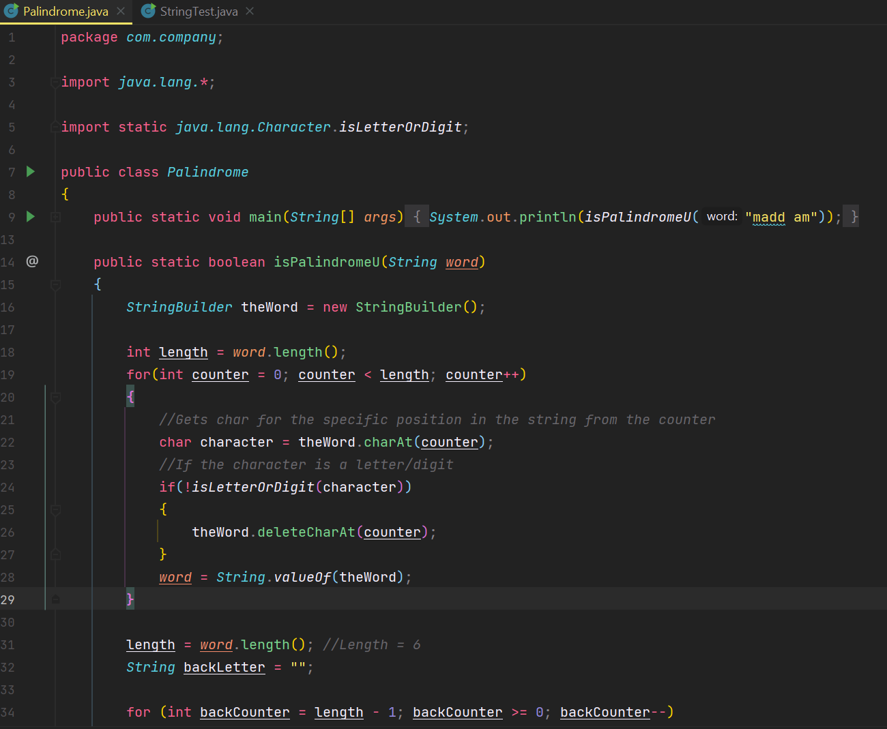
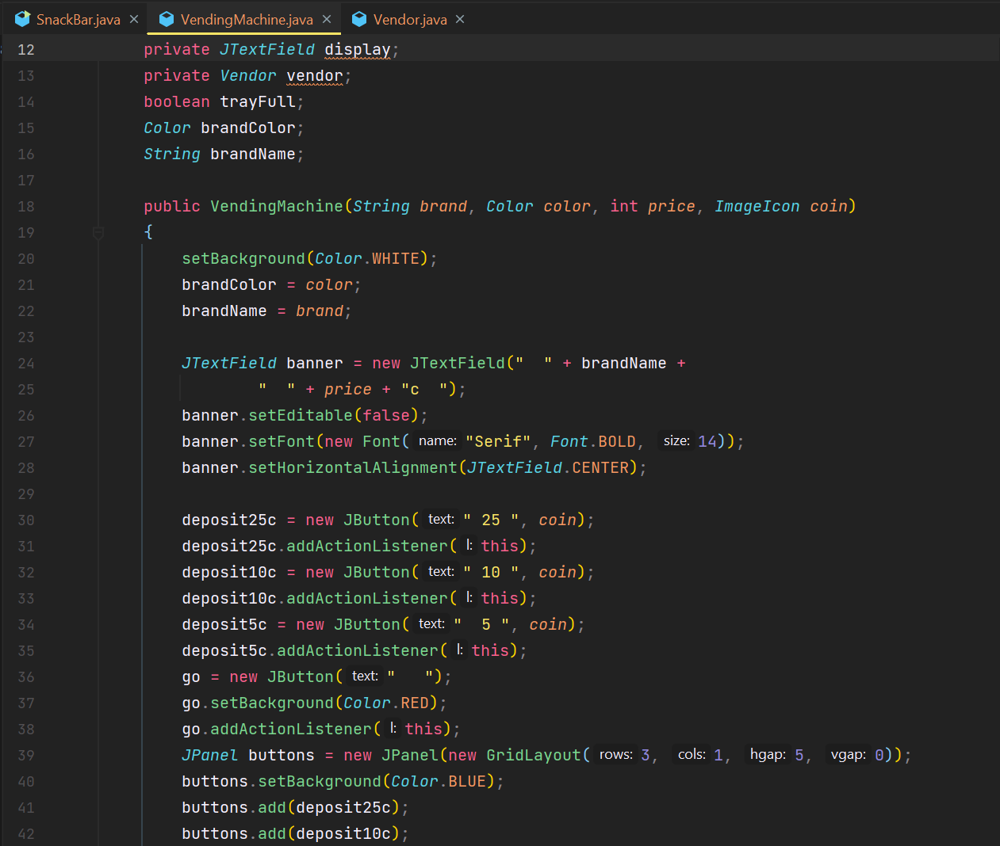

### Forward
  All programs assigned from the Java Methods Object-Oriented Programming and Data Structures textbook.
  
  The `.java` files are provided for all programs assigned in Mr. Tenzca's AP Computer Science A class from 2021-2022. 
  
  >Benevolently provided *for the benefit of humankind and confused students* 😝.

### Contents
All programs are labelled in the format: `Page#-Chapter#-Excersize#-Description`
  - `Chapter 2 - An Introduction to Software Engineering`
  - `Chapter 3 - Objects and Classes`
  - `Chapter 4 - Algorithms`
  - `Chapter 5 - Java Syntax and Style`
  - `Chapter 6 - Data Types, Variables, and Artithmetic`
  - `Chapter 7 - Boolean Expressions and if-else Statements`
  - `Chapter 8 - Iterative Statements: while, for, do-while`
  - `Chapter 9 - Implementing Classes and Using objects`
  - `Chapter 10 - Strings`
  - `Chapter 11 - Class Hierarchies and Interfaces`
  - `Chapter 12 - Arrays`
  - `Chapter 13 - ArrayLists`
  
### ⚠ Warnings ⚠
  Although this GitHub Repository may provide nearly all the programs necessitated for the majority of the class, (as of 2021's class), actually completing the programs by yourself is always the best way to succeed. These programs are intended as **reference-only** and no personal responsibility is taken for the contents of the code. Attempt to code the solutions yourself, and only if you are lost, attempt to integrate and modify certain aspects of this repository into your own code. You should understand exactly what each line of code does before implementing it into your program. Asking others for help is always the best solution.
  

